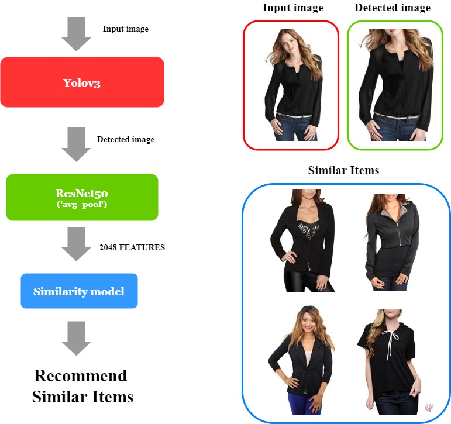

# Personalized Fashion Recommender system

Fast fashion is a contemporary term used by fashion retailers to express that designs move from catwalk quickly to capture current fashion trends. Nowadays, a lot of new clohtes are released every day. We look into the monitor all day long to find a favorite clothes among those numerous clothes. It's really time-consuming!! Recommener system could solve this challenge. Recommender system provide users with perosnalized recommendation for clothes, which consider their preference and need.
  
But if you look more closely, there are many more things to consider. As fashion trends change rapidly, people's preferences for clothes change as well. There is also a need to consider seasonality. For example, when winter starts, problems arise because you need to use data from the previous winter to recommend clothes to users. Finally, aesthetics, social consciousness and context must also be considered. Imagine you are wearing red tops, bottoms and shoes, which is really terrible!! And imagine wearing short sleeves, shorts and slippers as a wedding guest dress. This is also terrible.
  
- Will users be happy if they recommended a similar style of clothing? Few people buy clothes of similar style or similar color or similar pattern that they have already purchased.
  
- Will users be happy if they recommend items using the 'knn' model? Because the users are all different, the model may not work well.  
  
- Will users be satisfied if they recommends items by creating a preference-based model that considers the image of the product? It will solve the cold start problem, but it does less to help the user discover different types of items that he might like as much  
  
Through the defined evaluation method, it is possible to predict that the user will be satisfied, but it is not known whether the user is actually satisfied. It is very difficult to create a model to satisfy human emotions. However, this project will satisfy users by recommending items using various reasonable models.

## Similarity based Recommender system

### Similarity Model Architecture

##
### Item Recommendation Example

### Item Recommendation Example

